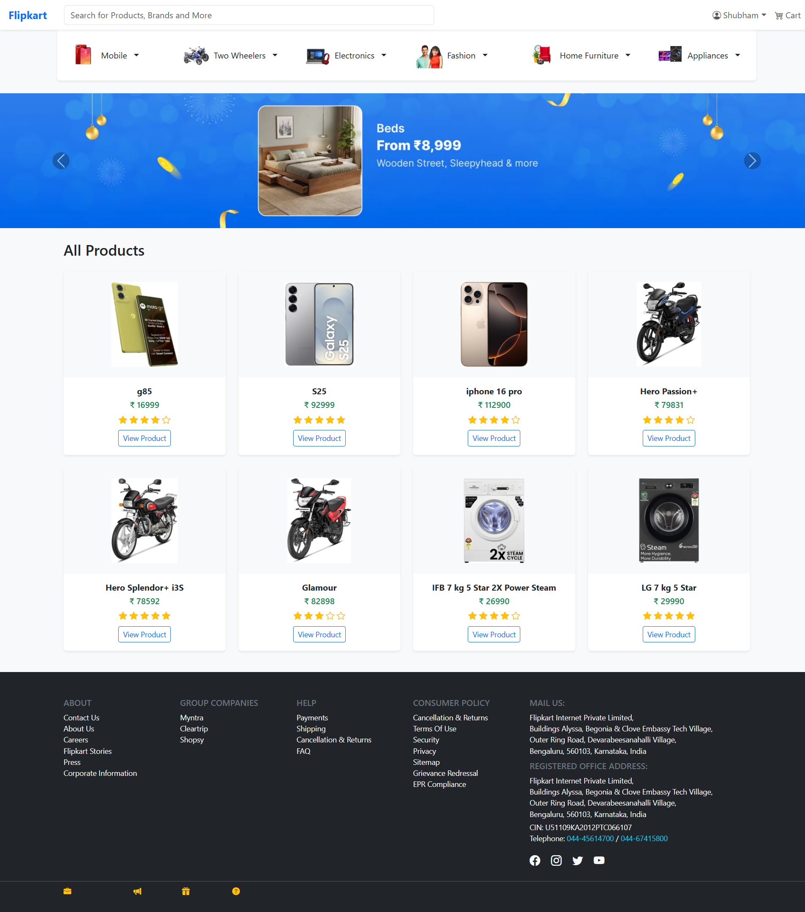
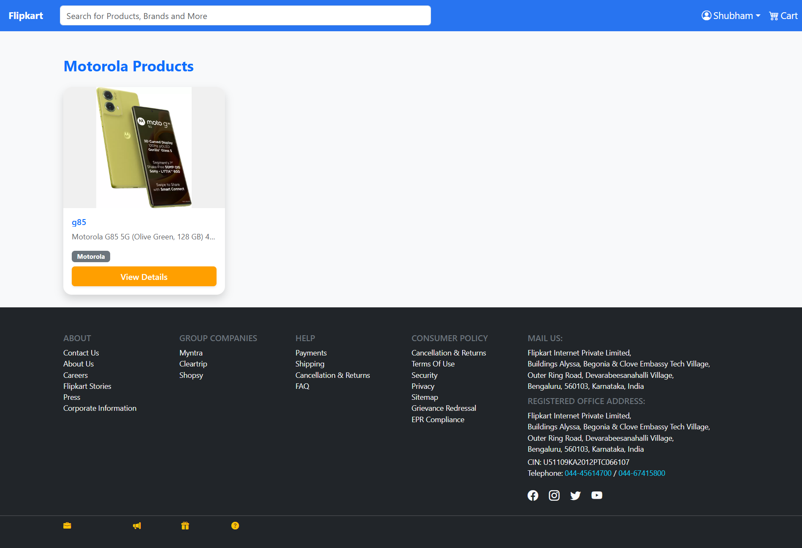
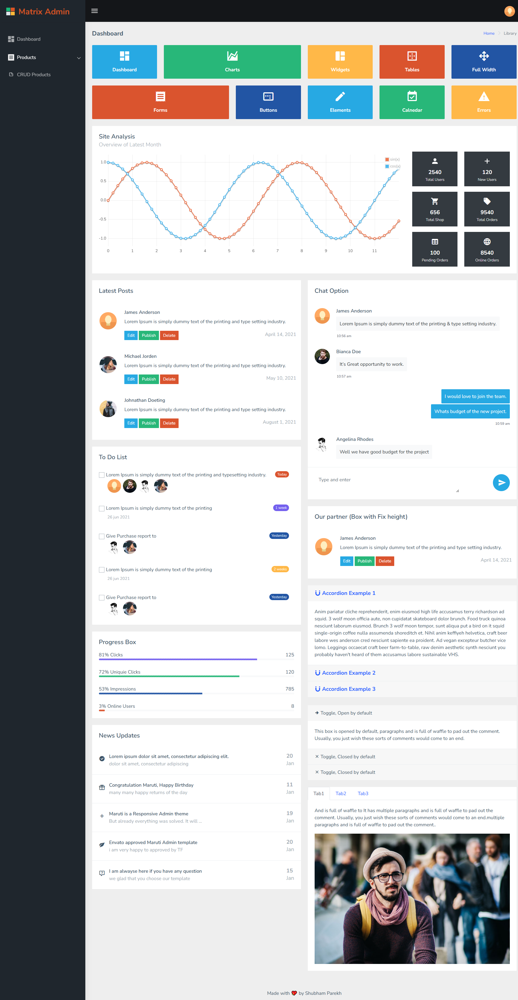
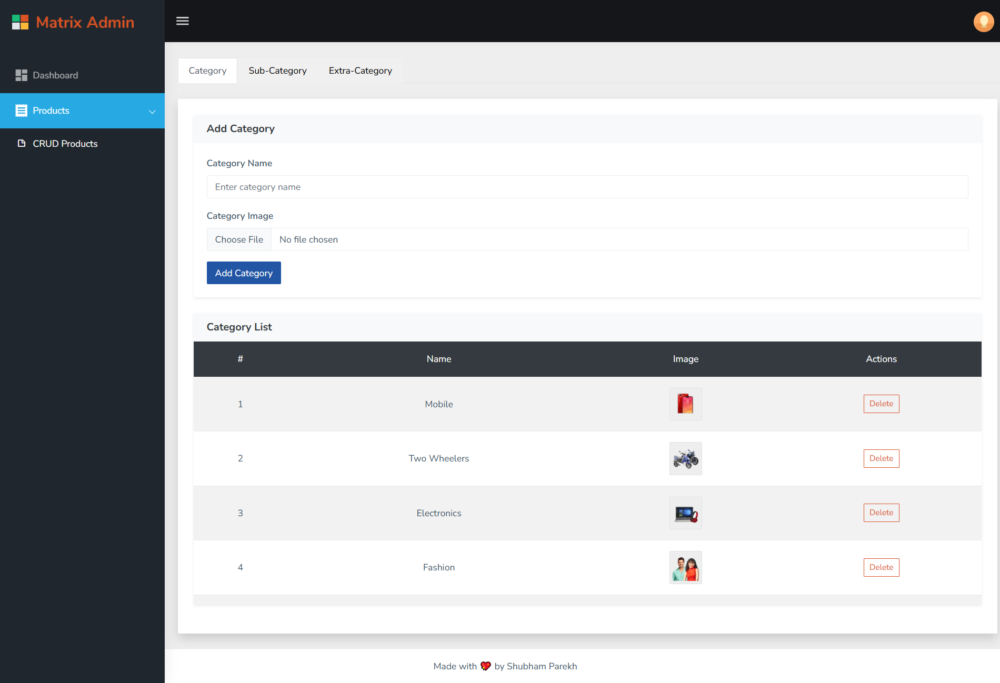
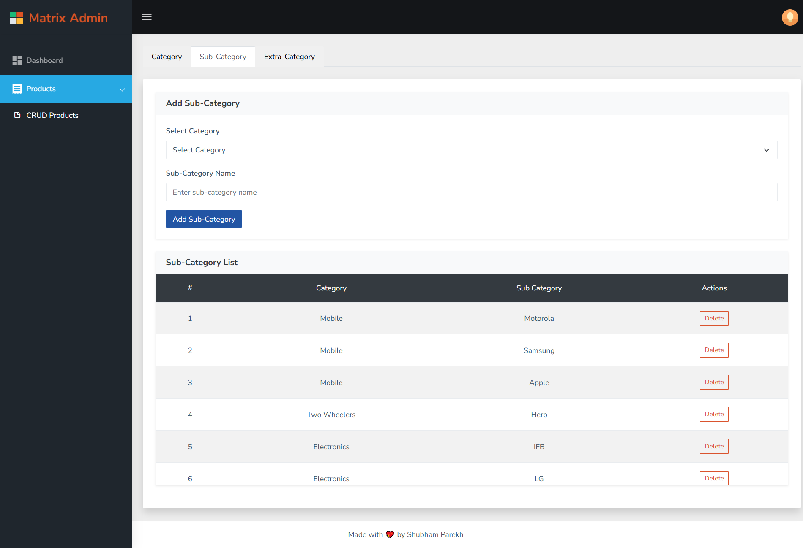
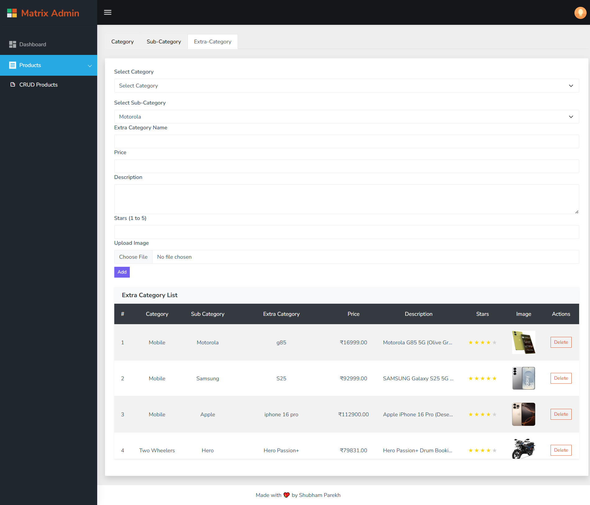

# 🛒 Flipykart (Flipkart Clone)

Flipykart is a learning project — a simplified Flipkart-style e-commerce platform built using Node.js, Express.js, MongoDB, and EJS. The application includes both client and admin panels with features like category management, authentication, and product listing.

🔗 Live Demo: https://flipykart.onrender.com

## 📌 Features

### 👥 Client Side

- Landing page with static Bootstrap carousel.
- Dynamic listing of categories, sub-categories, and products (extra-categories).
- Clicking on a category shows related sub-categories.
- Clicking on sub-categories reveals product cards.
- Product cards link to individual single-page view for more details.

### 🛠️ Admin Side

- Authentication using Passport.js and express-session.
- Admin Dashboard to:
  - Add categories, sub-categories, and extra-categories (products).
  - Form-based CRUD operations using EJS.
- Image upload functionality via Multer.
- Secured routes using Passport-local strategy.

🛂 Admin Panel: https://flipykart.onrender.com/admin/admindashBoard

🔐 If not logged in, it redirects to login page.  
🔑 Default credentials:  
Username: admin  
Password: 123

## ⚙️ Tech Stack

- Backend: Node.js, Express.js
- Database: MongoDB, Mongoose
- Templating: EJS
- Authentication: Passport.js, express-session
- Image Upload: Multer
- Environment Config: dotenv

## 🧾 Installation & Run Locally

1. Clone the Repository
   git clone https://github.com/yourusername/flipykart.git
   cd flipykart

2. Install Dependencies
   npm install

3. Setup Environment Variables
   Create a .env file and add your values:

PORT=3000  
MONGODB_URI=your_mongodb_connection_string  
SESSION_SECRET=your_secret_key

4. Run the Server
   npm start

Server runs on http://localhost:3000

## 📂 Folder Structure (Brief)

E-COMMERCE/
├── configs/ # Database config
├── controllers/ # Route logic
├── middleware/ # Image upload
├── models/ # Mongoose models
├── routers/ # Express routers
├── views/ # EJS views (admin/client/partials)
├── public/ # Static assets
├── uploads/ # Uploaded images
├── .env  
├── package.json  
└── README.md

## 🖼️ Screenshots

### 🔷 Home Page

### 🔷 Sub-Category Products

### 🔷 Single Product Page

### 🔷 Admin Login

### 🔷 Admin Dashboard

### 🔷 Add/Delete Category

### 🔷 Add/Delete Sub Category

### 🔷 Add/Delete Extra Category

## 🙋‍♂️ Author

Made with ❤️ by [Shubham Parekh]  
📧 Email: Shubhamparekh04@gmail.com
